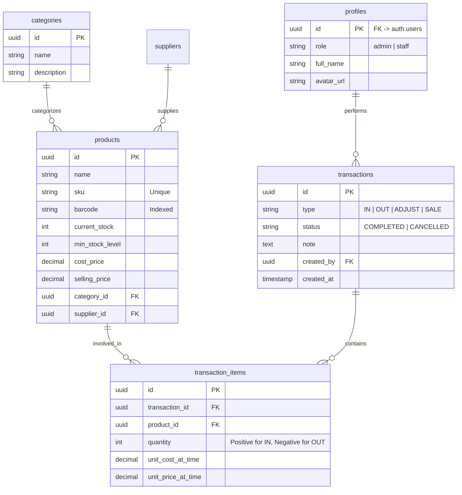

# 🗄️ Database Schema

## Overview
This schema is designed for **Supabase (PostgreSQL)**.
- **Auth:** Uses Supabase Auth (`auth.users`).
- **Security:** RLS (Row Level Security) is enabled on ALL tables.
- **Realtime:** Enabled for `products` and `transactions` tables to support instant updates.

## Entity Relationship Diagram (Mermaid)

## Table Details

### 1. Profiles (`profiles`)
Public profile for users, synchronized with `auth.users` via triggers.
- `id`: UUID (Primary Key, Foreign Key to `auth.users.id`)
- `role`: Enum ('admin', 'staff') - Controls RLS policies.
- `full_name`: Text
- `avatar_url`: Text

### 2. Categories (`categories`)
Group products (e.g., Coffee Beans, Milk, Syrups, Pastries).
- `id`: UUID (Default: `gen_random_uuid()`)
- `name`: Text (Unique)

### 3. Products (`products`)
The core inventory items.
- `id`: UUID
- `sku`: Text (Unique) - Internal code.
- `barcode`: Text (Indexed) - For scanning.
- `current_stock`: Integer - **Denormalized** field for speed. Updated via triggers or application logic.
- `min_stock_level`: Integer - Threshold for specific Low Stock Alerts.

### 4. Transactions (`transactions`)
Ledger of all stock movements. **Immutable** mostly.
- `type`: Enum ('IN' [Restock], 'OUT' [Usage/Waste], 'SALE' [POS], 'ADJUST' [Audit])
- `created_at`: Timestamptz (Default: `now()`)

### 5. Transaction Items (`transaction_items`)
Line items for each transaction.
- `quantity`: Integer.
  - If `type` = 'IN', quantity > 0
  - If `type` = 'OUT'/'SALE', quantity < 0
  - If `type` = 'ADJUST', quantity is the *difference* or absolute adjustment (depending on business logic, usually difference).

## Security Policies (RLS)
- **Admin:** ALL permissions on ALL tables.
- **Staff:**
  - `products`: SELECT, UPDATE (stock only)
  - `transactions`: INSERT, SELECT
  - `categories`: SELECT
